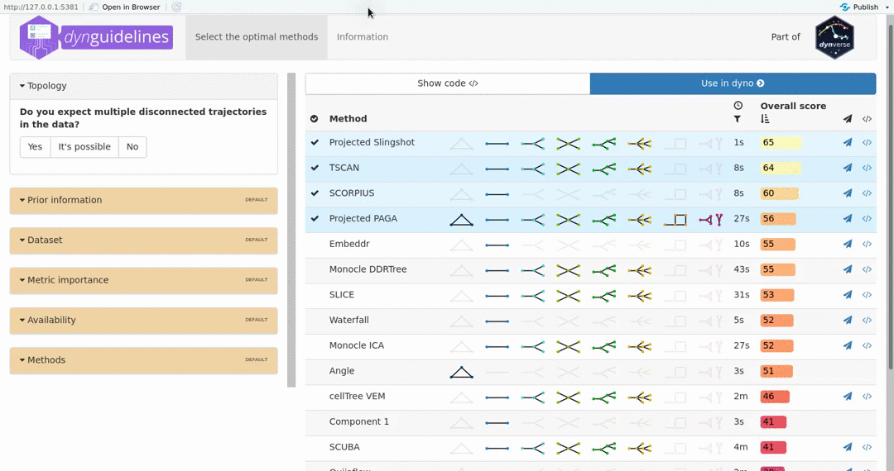

<!-- README.md is generated from README.Rmd. Please edit that file -->

```{r setup, include = FALSE}
knitr::opts_chunk$set(
  collapse = TRUE,
  comment = "#>",
  fig.path = "man/figures/README-",
  out.width = "100%",
  message = FALSE,
  dpi = 300
)
```
# Inferring trajectories using dyno 

The dyno package guides the user through the full path of trajectory inference on single-cell data, starting from the selection of the most optimal methods, to the running of these methods, right to the interpretation and visualisation of the trajectories.

## Installation

You can install dyno from github using:

``` r
# install.packages("devtools")
devtools::install_github("dynverse/dyno")
```

## Example
Inferring and interpreting trajectories consists of three main steps
```{r}
library(dyno)
library(tidyverse)

data("fibroblast_reprogramming_treutlein")
task <- fibroblast_reprogramming_treutlein
```

### Selection of the best methods

The choice of method depends on several factors, such as prior expectations of the topology present in the data, dataset size, and personal preferences. To select the best methods given a certain task we use the results from [@saelens_comparisonsinglecelltrajectory_2018] ([doi](https://doi.org/10.1101/276907)).

``` r
guidelines <- guidelines_shiny(task)
methods <- guidelines$methods %>% filter(selected) %>% pull(method_id) %>% first()
```

```{r, echo=FALSE}
# movie generated using vokoscreen
# converted to gif using ffmpeg:
# ffmpeg -i man/figures/dynguidelines.mkv -vf scale=1080:-1 -r 10 -f image2pipe -vcodec ppm - | convert -delay 5 -loop 0 -layers OptimizeFrame -fuzz 15% - man/figures/dynguidelines.gif

guidelines <- guidelines(task, answers=list(multiple_disconnected="No", expect_topology="Yes", expected_topology="Bifurcating"))
methods <- guidelines$methods %>% pull(method_id) %>% first()
```



### Running the methods

``` r
start_dynmethods_docker()

model %<-% infer_trajectory(task, methods[[1]])
```

```{r, echo=FALSE}
model <- infer_trajectory(task, methods[[1]])
```


### Rooting the trajectory

Most methods (although not all) have no direct way of inferring the directionality of the trajectory. In this case, the trajectory should be "rooted" using some external information, for example by using a set of marker genes.

```{r}
model <- model %>% 
  add_root_using_expression(c("Msn", "Tpm4", "Anxa1", "Timp1", "Vim"), task$expression) %>% 
  root_trajectory()
```

### Plotting the trajectory

```{r}
plot_dimred(model, expression_source = task$expression, dimred_method = dimred_mds, grouping_assignment = task$grouping)
```

### Plotting relevant features

```{r, fig.height=8}
plot_heatmap(model, expression_source = task$expression, grouping_assignment = task$grouping, features_oi = 50)
```

