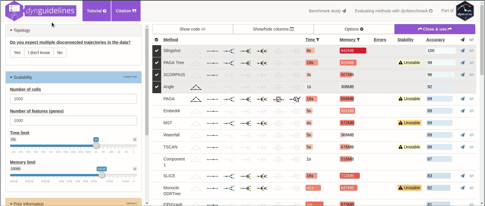

<!-- README.md is generated from README.Rmd. Please edit that file -->

[](https://travis-ci.org/dynverse/dyno)
[](https://ci.appveyor.com/project/dynverse/dyno)


```{r setup, include = FALSE}
knitr::opts_chunk$set(
  collapse = TRUE,
  comment = "#>",
  out.width = "100%",
  fig.path = "man/figures/",
  message = FALSE,
  dpi = 300
)
set.seed(1)
```

The **dyno** package offers **end-users** a complete TI pipeline. It features:

* a uniform interface to `r nrow(dynmethods::methods)` [TI methods](https://github.com/dynverse/dynmethods#list-of-included-methods),
* an [interactive guideline tool](https://github.com/dynverse/dyno#selecting-the-most-optimal-ti-methods) to help the user select the most appropriate method, 
* [streamlined interpretation and visualisation of trajectories](https://github.com/dynverse/dyno#plotting-the-trajectory), including colouring by gene expression or clusters, and
* downstream analyses such as the [identification of potential marker genes](https://github.com/dynverse/dyno#predicting-and-visualising-genes-of-interest).

For information on how to install dyno, check out the [installation instructions below](https://github.com/dynverse/dyno#installation).

## Trajectory inference workflow
```{r}
library(dyno)
library(tidyverse)
```

The whole trajectory inference workflow is divided in several steps:


### Preparing the data

The first step is to prepare the data for trajectory inference using `wrap_expression`. It requires both the counts and normalised expression (with genes/features in columns) as some TI methods are specifically built for one or the other:

```{r}
data("fibroblast_reprogramming_treutlein")

dataset <- wrap_expression(
  counts = fibroblast_reprogramming_treutlein$counts,
  expression = fibroblast_reprogramming_treutlein$expression
)
```

### Selecting the most optimal TI methods

When the data is wrapped, the most performant and scalable set of tools can be selected using a shiny app. This app will select a set of methods which are predicted to produce the most optimal output given several user-dependent factors (such as prior expectations about the topology present in the data) and dataset-dependent factors (such as the size of the dataset). This app uses the benchmarking results from [dynbenchmark](https://github.com/dynverse/dynbenchmark) ([doi:10.1101/276907](https://doi.org/10.1101/276907)).

``` r
guidelines <- guidelines_shiny(dataset)
methods_selected <- guidelines$methods_selected
```

```{r, echo=FALSE}
# movie generated using vokoscreen
# converted to gif using ffmpeg:
# ffmpeg -i ../dynguidelines/man/figures/demo.mkv -vf scale=1080:-1 -r 10 -f image2pipe -vcodec ppm - | convert -delay 10 -loop 0 -layers OptimizeFrame -fuzz 10% - ../dynguidelines/man/figures/demo.gif
# cp ../dynguidelines/man/figures/demo.gif man/figures/dynguidelines.gif

guidelines <- guidelines(dataset, answer_questions(multiple_disconnected = FALSE, expect_topology = TRUE, expected_topology = "bifurcation"))
methods_selected <- guidelines$methods_selected
```




### Running the methods

To run a method, it is currently necessary to [have docker installed](#installation). If that's the case, running a method is a one-step-process. We will run the first selected method here:

``` r
model <- infer_trajectory(dataset, first(methods_selected))
```

```{r, echo=FALSE}
model <- infer_trajectory(dataset, first(methods_selected))

if (is.na(first(model))) {
  print(attr(model, "summary")$error)
  stop("Method errored")
}
```

### Interpreting the trajectory biologically
In most cases, some knowledge is present of the different start, end or intermediary states present in the data, and this can be used to adapt the trajectory so that it is easier to interpret.


#### Rooting
Most methods have no direct way of inferring the directionality of the trajectory. In this case, the trajectory should be "rooted" using some external information, for example by using a set of marker genes.

```{r}
model <- model %>% 
  add_root_using_expression(c("Vim"), dataset$expression)
```


#### Milestone labelling

Milestones can be labelled using marker genes. These labels can then be used for subsequent analyses and for visualisation.

```{r}
model <- label_milestones_markers(
  model,
  markers = list(
    MEF = c("Vim"),
    Myocyte = c("Myl1"),
    Neuron = c("Stmn3")
  ),
  dataset$expression
)
```


### Plotting the trajectory
Several visualisation methods provide ways to biologically interpret trajectories. 

Examples include combining a dimensionality reduction, a trajectory model and a cell clustering:
```{r dimred}
model <- model %>% add_dimred(dyndimred::dimred_mds, expression_source = dataset$expression)
plot_dimred(
  model, 
  expression_source = dataset$expression, 
  grouping = fibroblast_reprogramming_treutlein$grouping
)
```

Similarly, the expression of a gene:
```{r dimred_expression}
plot_dimred(
  model, 
  expression_source = dataset$expression,
  feature_oi = "Fn1"
)
```

Groups can also be visualised using a background color
```{r dimred_groups}
plot_dimred(
  model, 
  expression_source = dataset$expression, 
  color_cells = "feature",
  feature_oi = "Vim",
  color_density = "grouping",
  grouping = fibroblast_reprogramming_treutlein$grouping,
  label_milestones = FALSE
)
```


### Predicting and visualising genes of interest

We integrate several methods to extract candidate marker genes/features from a trajectory.

#### A global overview of the most predictive genes

At default, the overall most important genes are calculated when plotting a heatmap.

```{r heatmap, fig.height=8, fig.width=12}
plot_heatmap(
  model,
  expression_source = dataset$expression,
  grouping = fibroblast_reprogramming_treutlein$grouping,
  features_oi = 50
)
```

#### Lineage/branch markers

We can also extract features specific for a branch, eg. genes which change when a cell differentiates into a Neuron

```{r}
branch_feature_importance <- calculate_branch_feature_importance(model, expression_source=dataset$expression)

neuron_features <- branch_feature_importance %>% 
  filter(to == which(model$milestone_labelling =="Neuron")) %>% 
  top_n(50, importance) %>% 
  pull(feature_id)
```

```{r branch, fig.height=8, fig.width=12}
plot_heatmap(
  model, 
  expression_source = dataset$expression, 
  features_oi = neuron_features
)
```


#### Genes important at bifurcation points

We can also extract features which change at the branching point

```{r branching_point, fig.height=5, fig.width=12}
branching_milestone <- model$milestone_network %>% group_by(from) %>% filter(n() > 1) %>% pull(from) %>% first()

branch_feature_importance <- calculate_branching_point_feature_importance(model, expression_source=dataset$expression, milestones_oi = branching_milestone)

branching_point_features <- branch_feature_importance %>% top_n(20, importance) %>% pull(feature_id)

plot_heatmap(
  model,
  expression_source = dataset$expression,
  features_oi = branching_point_features
)
```

```{r, branching_point_dimred}
space <- dyndimred::dimred_mds(dataset$expression)
map(branching_point_features[1:12], function(feature_oi) {
  plot_dimred(model, dimred = space, expression_source = dataset$expression, feature_oi = feature_oi, label_milestones = FALSE) +
    theme(legend.position = "none") +
    ggtitle(feature_oi)
}) %>% patchwork::wrap_plots()
```


## Installation

You can install dyno from github using:

``` r
# install.packages("devtools")
devtools::install_github("dynverse/dyno")
```

On Linux, you will need to install udunits and ImageMagick:

* Debian / Ubuntu / Linux Mint: `sudo apt-get install libudunits2-dev imagemagick`
* Fedora / CentOS / RHEL: `sudo dnf install udunits2-devel ImageMagick-c++-devel`

[Docker](https://docs.docker.com/install) has to be installed to run TI methods. See https://docs.docker.com/install for instructions. For windows 10 you can install [Docker CE](https://store.docker.com/editions/community/docker-ce-desktop-windows), older windows installations require the [Docker toolbox](https://docs.docker.com/toolbox/overview/).

You can test whether docker is correctly installed by running:

```{r, message = TRUE}
dynwrap::test_docker_installation(detailed = TRUE)
```

This command will give helpful tips if some parts of the installation are missing.
