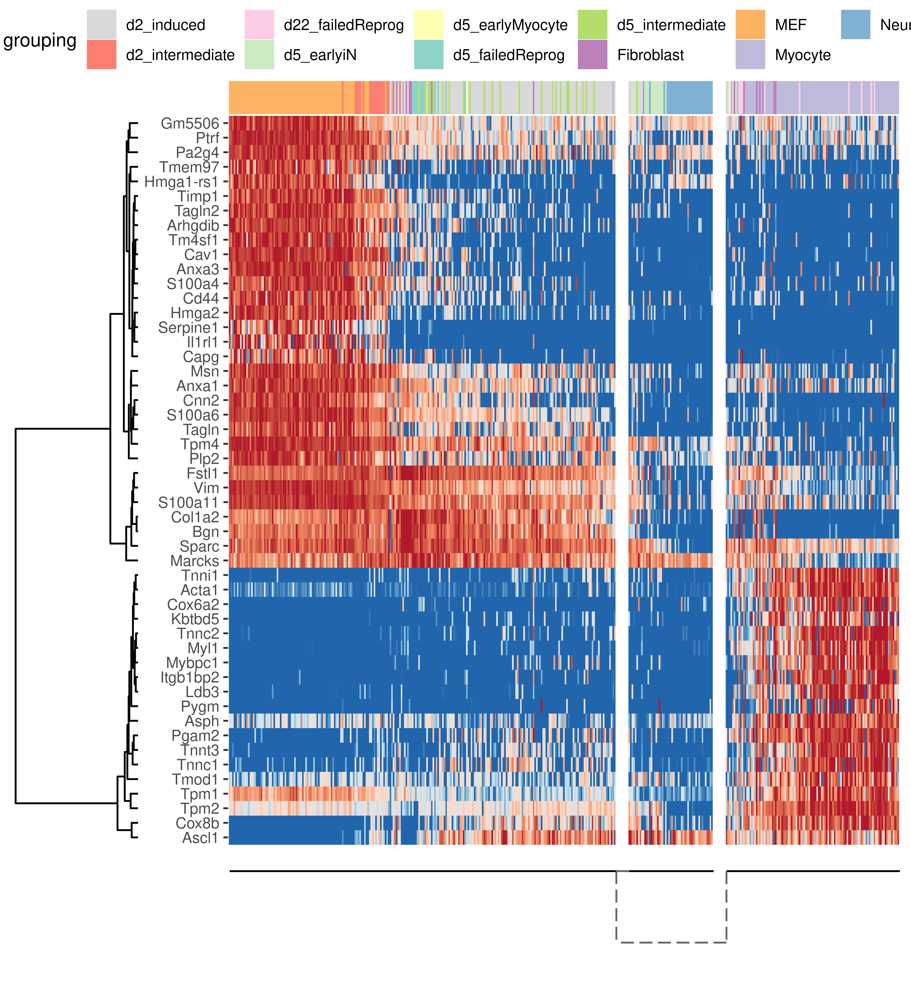

<!-- README.md is generated from README.Rmd. Please edit that file -->
Inferring trajectories using dyno 
===========================================================================

The dyno package guides the user through the full path of trajectory inference on single-cell data, starting from the selection of the most optimal methods, to the running of these methods, right to the interpretation and visualisation of the trajectories.

Installation
------------

You can install dyno from github using:

``` r
# install.packages("devtools")
devtools::install_github("dynverse/dyno")
```

Example
-------

Inferring and interpreting trajectories consists of three main steps

``` r
library(dyno)
#> Warning: replacing previous import 'dplyr::vars' by 'ggplot2::vars' when
#> loading 'dynmethods'
library(tidyverse)

data("fibroblast_reprogramming_treutlein")
task <- fibroblast_reprogramming_treutlein
```

### Selection of the best methods

The choice of method depends on several factors, such as prior expectations of the topology present in the data, dataset size, and personal preferences. To select the best methods given a certain task we use the results from (Saelens et al. 2018) ([doi](https://doi.org/10.1101/276907)).

``` r
guidelines <- guidelines_shiny(task)
methods <- guidelines$methods %>% filter(selected) %>% pull(method_id) %>% first()
```


### Running the methods

``` r
start_dynmethods_docker()

model %<-% infer_trajectory(task, methods[[1]])
```

### Rooting the trajectory

Most methods (although not all) have no direct way of inferring the directionality of the trajectory. In this case, the trajectory should be "rooted" using some external information, for example by using a set of marker genes.

``` r
model <- model %>% 
  add_root_using_expression(c("Msn", "Tpm4", "Anxa1", "Timp1", "Vim"), task$expression) %>% 
  root_trajectory()
```

### Plotting the trajectory

``` r
plot_dimred(model, expression_source = task$expression, dimred_method = dimred_mds, grouping_assignment = task$grouping)
```



### Plotting relevant features

``` r
plot_heatmap(model, expression_source = task$expression, grouping_assignment = task$grouping, features_oi = 50)
```


Saelens, Wouter, Robrecht Cannoodt, Helena Todorov, and Yvan Saeys. 2018. “A Comparison of Single-Cell Trajectory Inference Methods: Towards More Accurate and Robust Tools.” *bioRxiv*, March, 276907. doi:[10.1101/276907](https://doi.org/10.1101/276907).
