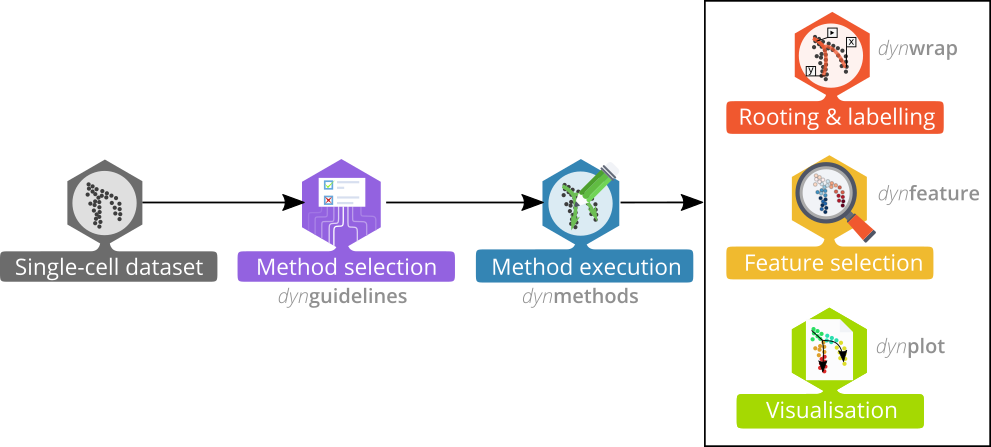
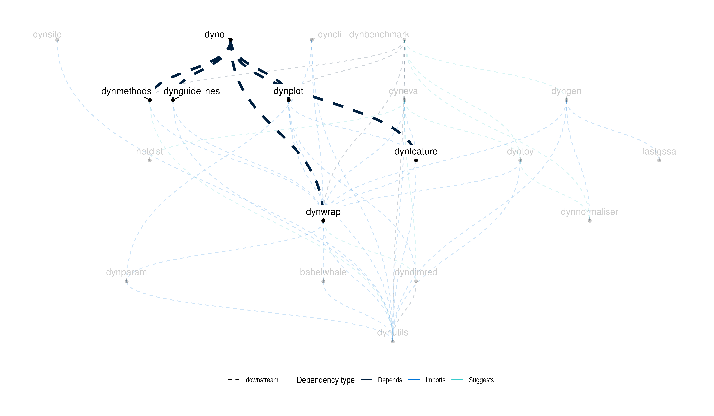

<!-- README.md is generated from README.Rmd. Please edit that file -->

[**ℹ️ Tutorials**](https://dynverse.org)     [**ℹ️ Reference
documentation**](https://dynverse.org/reference)
 

# Inferring trajectories using dyno

The **dyno** package offers **end-users** a complete TI pipeline. It
features:

  - a uniform interface to 60 [TI
    methods](https://github.com/dynverse/dynmethods#list-of-included-methods),
  - an [interactive guideline
    tool](https://github.com/dynverse/dynguidelines#selecting-the-most-optimal-ti-methods)
    to help the user select the most appropriate method,
  - [streamlined interpretation and visualisation of
    trajectories](https://dynverse.org/reference/dynplot/plot_trajectory/plot_dimred/#examples),
    including colouring by gene expression or clusters, and
  - downstream analyses such as the [identification of potential marker
    genes](https://dynverse.org/reference/dynplot/plot_trajectory/plot_heatmap/#examples).

**For information on how to use dyno, check out the installation
instructions, tutorials and documentation at
[dynverse.org](https://dynverse.org)**

## Latest changes

Check out `news(package = "dyno")` or [NEWS.md](NEWS.md) for a full list
of changes.

<!-- This section gets automatically generated from inst/NEWS.md -->

### Recent changes in dyno 0.1.1 (06-04-2019)

  - BUGFIX: Fixed example dataset

  - MINOR CHANGE: Bumping version requirement of dynmethods to 1.0.1.

### Recent changes in dyno 0.1.0 (29-03-2019)

  - Initial beta release of
dyno

## Dynverse dependencies

<!-- Generated by "update_dependency_graphs.R" in the main dynverse repo -->

