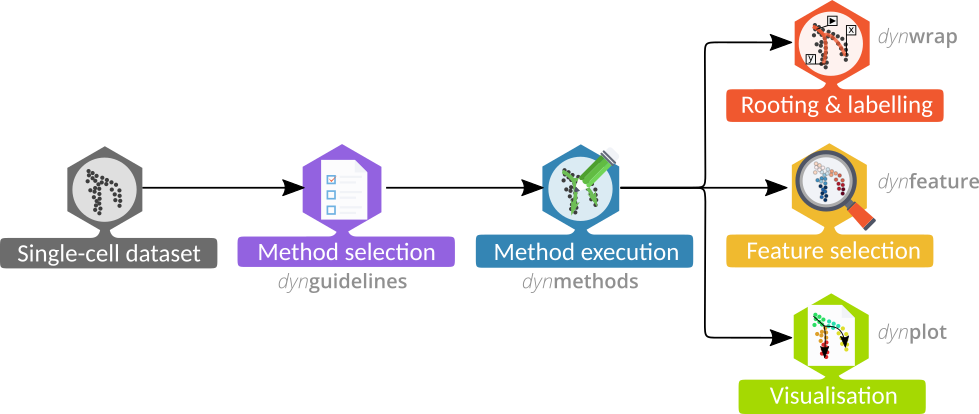
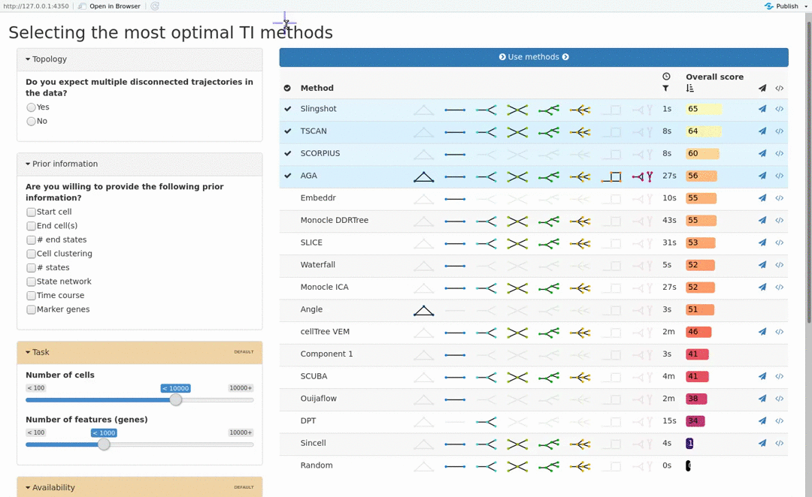
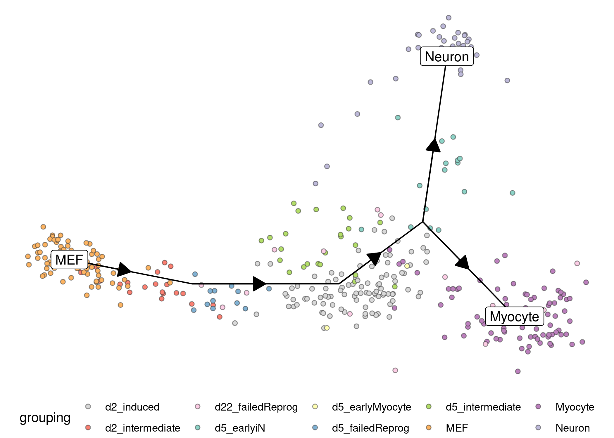
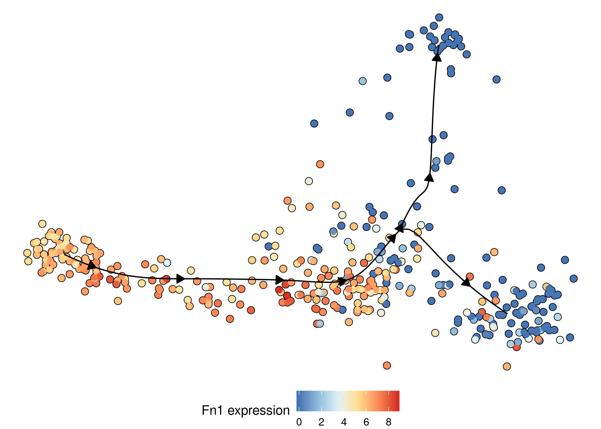
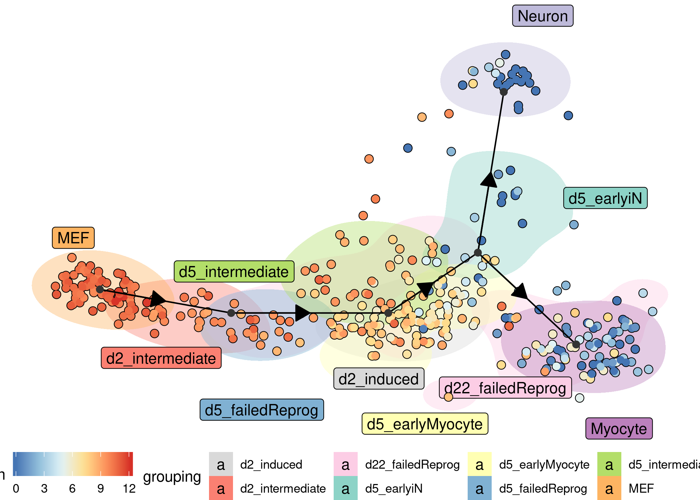
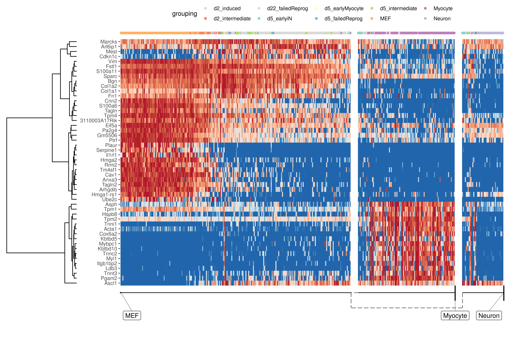
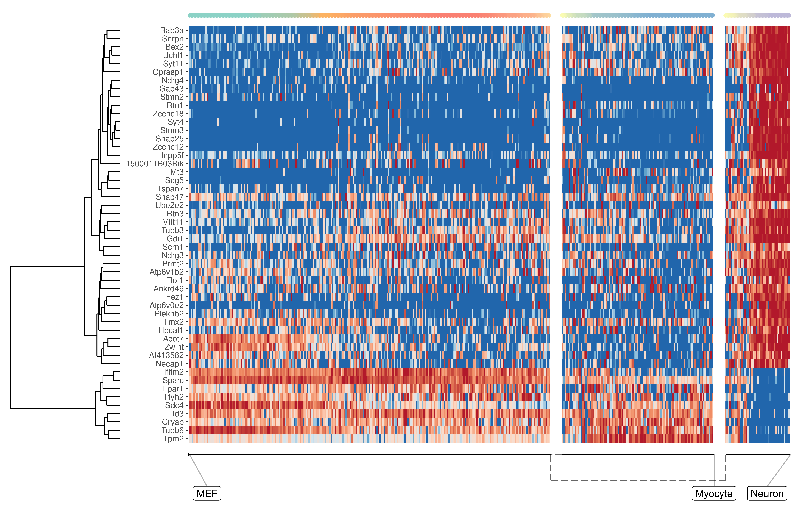
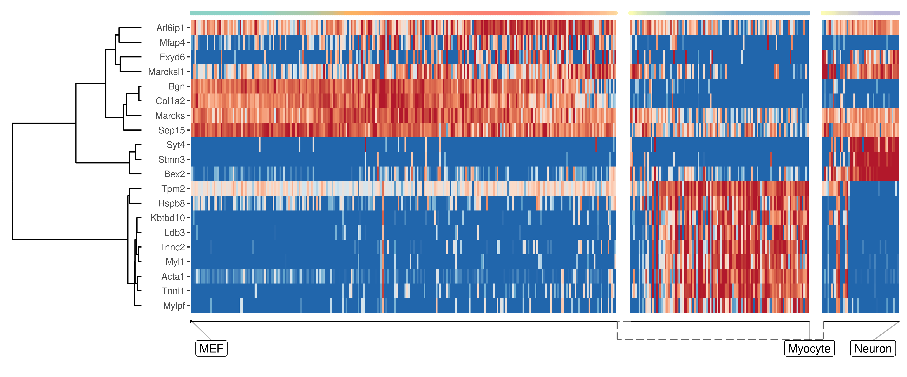
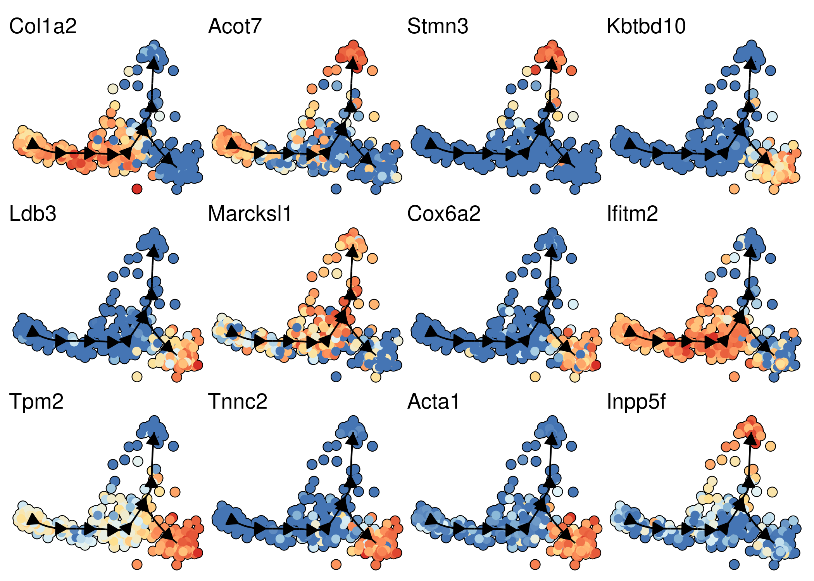

Inferring trajectories using dyno 
================

-   [Trajectory inference workflow](#trajectory-inference-workflow)
    -   [Preparing the data](#preparing-the-data)
    -   [Selecting the most optimal TI methods](#selecting-the-most-optimal-ti-methods)
    -   [Running the methods](#running-the-methods)
    -   [Interpreting the trajectory biologically](#interpreting-the-trajectory-biologically)
    -   [Plotting the trajectory](#plotting-the-trajectory)
    -   [Predicting and visualising genes of interest](#predicting-and-visualising-genes-of-interest)
-   [Installation](#installation)

<!-- README.md is generated from README.Rmd. Please edit that file -->
[](https://travis-ci.org/dynverse/dyno) [](https://ci.appveyor.com/project/dynverse/dyno) 

The **dyno** package offers **end-users** a complete TI pipeline. It features:

-   a uniform interface to 50 [TI methods](https://github.com/dynverse/dynmethods#list-of-included-methods),
-   an [interactive guideline tool](https://github.com/dynverse/dyno#selecting-the-most-optimal-ti-methods) to help the user select the most appropriate method,
-   the [interpretation and visualisation of trajectories](https://github.com/dynverse/dyno#plotting-the-trajectory), including colouring by gene expression or clusters, and
-   downstream analyses such as the [identification of potential marker genes](https://github.com/dynverse/dyno#predicting-and-visualising-genes-of-interest).

For information on how to install dyno, check out the [installation instructions below](https://github.com/dynverse/dyno#installation).

Trajectory inference workflow
-----------------------------

``` r
library(dyno)
library(tidyverse)
```

The whole trajectory inference workflow is divided in several steps:



### Preparing the data

The first step is to prepare the data for trajectory inference. `wrap_expression` requires both the counts and normalised expression as some TI methods are specifically built for one or the other

``` r
data("fibroblast_reprogramming_treutlein")

task <- wrap_expression(
  counts = fibroblast_reprogramming_treutlein$counts,
  expression = fibroblast_reprogramming_treutlein$expression
)
```

### Selecting the most optimal TI methods

The choice of method depends on several factors, such as prior expectations of the topology present in the data, dataset size, and personal preferences. To select the best methods given a certain dataset and user preferences, we use the results from the [dynalysis](https://github.com/dynverse/dynalysis) benchmarking study.

``` r
guidelines <- guidelines_shiny(task)
methods <- guidelines$methods %>% filter(selected) %>% pull(method_id) %>% first()
```



### Running the methods

All available methods were wrapped within a common interface, which makes running a method a one-step-process. For running the methods, it is strongly recommended to [have docker installed](#Installation).

``` r
model <- infer_trajectory(task, "tscan")
```

### Interpreting the trajectory biologically

In most cases, some knowledge is present of the different start, end or intermediary states present in the data, and this can be used to adapt the trajectory so that it is easier to interpret.

#### Rooting

Most methods have no direct way of inferring the directionality of the trajectory. In this case, the trajectory should be "rooted" using some external information, for example by using a set of marker genes.

``` r
model <- model %>% 
  add_root_using_expression(c("Vim"), task$expression)
```

#### Milestone labelling

Milestones can be labelled using marker genes. These labels can then be used for subsequent analyses and for visualisation.

``` r
model <- label_milestones_markers(
  model,
  markers = list(
    MEF = c("Vim"),
    Myocyte = c("Myl1"),
    Neuron = c("Stmn3")
  ),
  task$expression
)
```

### Plotting the trajectory

Several visualisation methods provide ways to biologically interpret trajectories.

Examples include combining a dimensionality reduction, a trajectory model and a cell clustering:

``` r
model <- model %>% add_dimred(dyndimred::dimred_mds, expression_source = task$expression)
plot_dimred(
  model, 
  expression_source = task$expression, 
  grouping = fibroblast_reprogramming_treutlein$grouping
)
```



Similarly, the expression of a gene:

``` r
plot_dimred(
  model, 
  expression_source = task$expression,
  feature_oi = "Fn1"
)
```



Groups can also be visualised using a background color

``` r
plot_dimred(
  model, 
  expression_source = task$expression, 
  color_cells = "feature",
  feature_oi = "Vim",
  color_density = "grouping",
  grouping = fibroblast_reprogramming_treutlein$grouping,
  label_milestones = FALSE
)
```



### Predicting and visualising genes of interest

We integrate several methods to extract candidate marker genes/features from a trajectory.

#### A global overview of the most predictive genes

At default, the overall most important genes are calculated when plotting a heatmap.

``` r
plot_heatmap(
  model,
  expression_source = task$expression,
  grouping = fibroblast_reprogramming_treutlein$grouping,
  features_oi = 50
)
```



#### Lineage/branch markers

We can also extract features specific for a branch, eg. genes which change when a cell differentiates into a Neuron

``` r
branch_feature_importance <- calculate_branch_feature_importance(model, expression_source=task$expression)

neuron_features <- branch_feature_importance %>% 
  filter(to == which(model$milestone_labelling =="Neuron")) %>% 
  top_n(50, importance) %>% 
  pull(feature_id)
```

``` r
plot_heatmap(
  model, 
  expression_source = task$expression, 
  features_oi = neuron_features
)
```



#### Genes important at bifurcation points

We can also extract features which change at the branching point

``` r
branching_milestone <- model$milestone_network %>% group_by(from) %>% filter(n() > 1) %>% pull(from) %>% first()

branch_feature_importance <- calculate_branching_point_feature_importance(model, expression_source=task$expression, milestones_oi = branching_milestone)

branching_point_features <- branch_feature_importance %>% top_n(20, importance) %>% pull(feature_id)

plot_heatmap(
  model,
  expression_source = task$expression,
  features_oi = branching_point_features
)
```



``` r
space <- dyndimred::dimred_mds(task$expression)
map(branching_point_features[1:12], function(feature_oi) {
  plot_dimred(model, dimred = space, expression_source = task$expression, feature_oi = feature_oi, label_milestones = FALSE) +
    theme(legend.position = "none") +
    ggtitle(feature_oi)
}) %>% patchwork::wrap_plots()
```



Installation
------------

You can install dyno from github using:

``` r
# install.packages("devtools")
devtools::install_github("dynverse/dyno")
```

On Linux, you will need to install udunits and ImageMagick:

-   Debian / Ubuntu / Linux Mint: `sudo apt-get install libudunits2-dev imagemagick`
-   Fedora / CentOS / RHEL: `sudo dnf install udunits2-devel ImageMagick-c++-devel`

Although not required, we also highly recommend you install [Docker](https://docs.docker.com/install). This will make it easy to run all available trajectory inference methods. See <https://docs.docker.com/install> for instructions.

You can test whether docker is correctly installed by running:

``` r
dynwrap::test_docker_installation(detailed = TRUE)
#> ✔ Docker is installed
#> ✔ Docker daemon is running
#> ✔ Docker is at correct version (>1.0): 1.37
#> ✔ Docker is in linux mode
#> ✔ Docker can pull images
#> ✔ Docker can run image
#> ✔ Docker can mount temporary volumes
#> ✔ Docker test succesful ------------------------------------------------------------------
#> [1] TRUE
```
